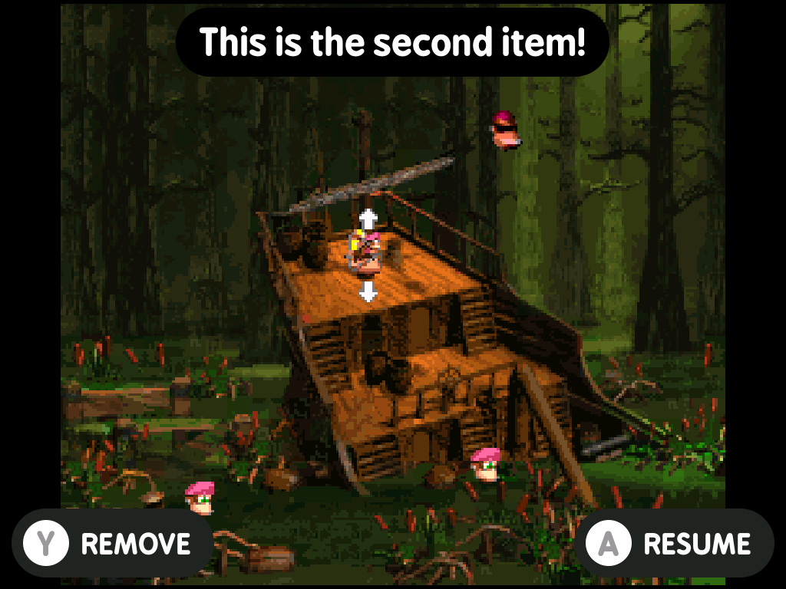
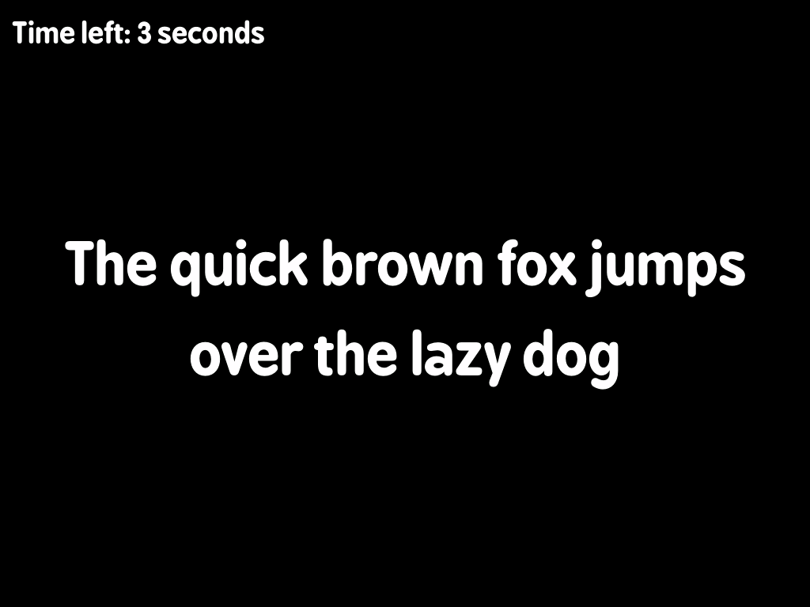

# minui presenter

This is a minui presentation app. It allows displaying messages on the screen with background colors and images.

## Requirements

- A minui union toolchain
- Docker (this folder is assumed to be the contents of the toolchain workspace directory)
- `make`

## Building

- todo: this is built inside-out. Ideally you can clone this into the MinUI workspace directory and build from there under each toolchain, but instead it gets cloned _into_ a toolchain workspace directory and built from there.

## Usage

```shell
minui-presenter --message "The quick brown fox jumps over the lazy dog"
```

### Options

#### Message Display

- `--message <text>`: Display a single message
- `--message-alignment <alignment>`: Set message alignment (default: middle)
  - Valid values: `top`, `middle`, `bottom`
- `--file <path>`: Path to JSON file containing messages
- `--item-key <key>`: Key in JSON file containing items array (default: `items`)

> [!IMPORTANT]
> Either the `--message` or `--file` argument must be specified

### Font Configuration

- `--font-default <path>`: Path to custom font file (default: built-in font)
- `--font-size-default <size>`: Font size for messages (default: `FONT_LARGE`)

### Button Configuration

#### Action Button

- `--action-button <button>`: Assign action button (default: none)
- `--action-text <text>`: Text for action button (default: `ACTION`)
- `--action-show`: Show action button (default: `false`)

#### Confirm Button

- `--confirm-button <button>`: Assign confirm button (default: `A`)
- `--confirm-text <text>`: Text for confirm button (default: `SELECT`)
- `--confirm-show`: Show confirm button (default: `false`)

#### Cancel Button

- `--cancel-button <button>`: Assign cancel button (default: `B`)
- `--cancel-text <text>`: Text for cancel button (default: `BACK`)
- `--cancel-show`: Show cancel button (default: `false`)

#### Inaction Button

- `--inaction-button <button>`: Assign inaction button (default: none)
- `--inaction-text <text>`: Text for inaction button (default: `OTHER`)
- `--inaction-show`: Show inaction button (default: `false`)

### Display Options

- `--show-hardware-group`: Show hardware information group (default: `false`)
- `--show-time-left`: Show countdown timer (default: `false`)
- `--timeout <seconds>`: Set timeout in seconds (default: `-1`, no timeout)

### Button Values

Valid button assignments are:

- `A`: A button
- `B`: B button
- `X`: X button
- `Y`: Y button

Note: Each hardware button can only be assigned once.

## Exit Codes

- `0`: Success
- `1`: Error
- `2`: Cancel button pressed
- `3`: Menu button pressed
- `4`: Action button pressed
- `5`: Inaction button pressed
- `6`: Start button pressed
- `124`: Timeout reached
- `130`: Keyboard interrupt (Ctrl+C)

## JSON File Format

When using `--file`, the JSON should follow this format:

```json
{
  "items": [
    {
      "text": "Message text",
      "background_image": "path/to/image.png",
      "background_color": "#000000",
      "show_pill": false,
      "alignment": "middle"
    }
  ]
}
```

### Item Properties

- `text`: The message to display
- `background_image`: (default: null) Path to background image. Will be stretched to fill screen by aspect ratio.
- `background_color`: (default: `#000000`) Hex color code for background
- `show_pill`: (default: `false`) Whether to show a pill around the text
- `alignment`: (default: `middle`) Message alignment ("top", "middle", "bottom")

## Screenshots

| Name                          | Image                                                                 |
|-------------------------------|-----------------------------------------------------------------------|
| Fullscreen image with Actions |  |
| Scaled image with Actions     |      |
| Message with Timeout          |           |
